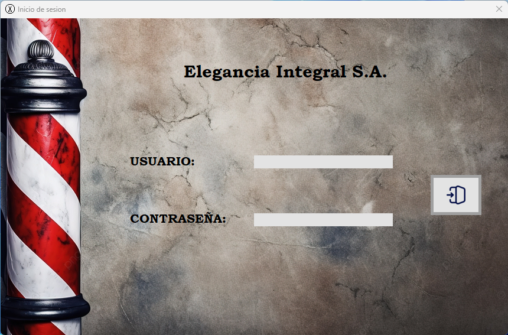
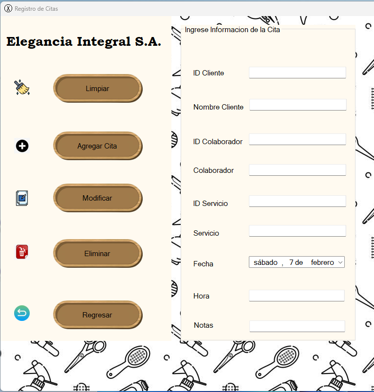
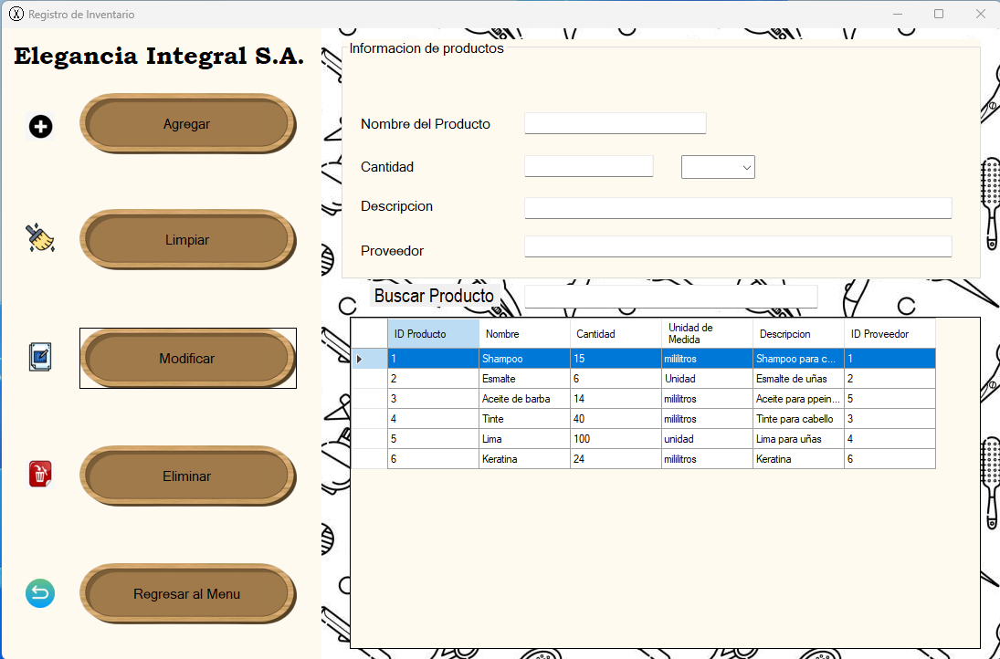

# Elegancia Integral S.A. – Salon Management System

**Academic Project (UAM) — Designed as a real-world desktop management system**

A C# (.NET) + SQL Server application built to manage the daily operations of a beauty salon, including appointment scheduling, client management, employee management, services, and inventory control.

---

## 🧰 Tech Stack
- **Language:** C#
- **Framework:** .NET (Windows Forms)
- **Database:** Microsoft SQL Server
- **Architecture:** Layered Architecture (**PL / BLL / DAL**)
- **Database Access:** Stored Procedures + DataTables

---

## 🎯 Key Features
- User login and role-based access (profiles)
- Client CRUD management
- Employee (collaborator) CRUD management
- Services CRUD management
- Appointment scheduling and appointment search
- Inventory module linked to services (service-consumption logic)
- SQL Server stored procedures for all database operations

---

## 🏗 Architecture
This project follows a layered architecture to ensure separation of concerns and maintainability:

- **PL (Presentation Layer):** Windows Forms UI  
- **BLL (Business Logic Layer):** Business rules and validations  
- **DAL (Data Access Layer):** SQL Server stored procedures and parameter handling  

---

## 🗄 Database Design
Relational database designed in SQL Server with foreign keys and relationships between:

- Users / Profiles
- Clients
- Services
- Appointments
- Inventory
- Providers
- ServiceInventory (service → inventory consumption)

---

## 📸 Screenshots

### Login

### Appointment Search

### Appointment Form

### Inventory Module

### Database Diagram

---

## 📚 What I Learned
- Building a layered architecture in .NET
- Using SQL Server stored procedures for CRUD operations
- Designing relational databases with integrity constraints
- Structuring a desktop system with real-world business logic

---

## 👤 Author
**Daniel Felipe Solano Quirós**  
- LinkedIn: https://www.linkedin.com/in/daniel-felipe-solano-quiros  
- GitHub: https://github.com/DnlSQ
